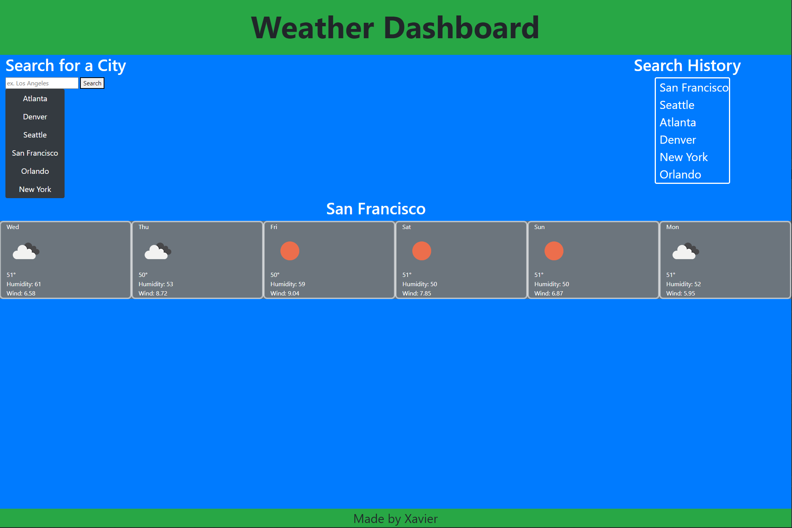

# Personal Weather Dashboard

## Description

This is a functional weather site that uses the open weather map api to present a 5 day forecast on whichever city you choose. It comes with default buttons that give the user preset choices on cities. Users can also use the serach bar to find a specific city if theirs is not listed in the default buttons. Finally, it shows a recent
history of up to (but no more than) 5 previous cities that were searched. This project uses bootstrap for some css framework, local storage api for the search history, ajax for both the location api pull and the weather forecast api pull, and used jquery to dynamically fill the page with the weather information along side updating the search history. This project was made to have a easy reference to any city's current and short term forecast on a simple and easy to use site.

## Table of Contents

- README file
- index.html: formatted to have the default buttons and a skeleton of sorts for the weather data to be filled with using jquery
- style.css: my own additions to the style to format the page a bit more
- script.js: contains all the javascript used for site functionality
- site-pic.png: picture of the site with a city forecast shown and full search history

## Links

[Direct Site Link](https://nyqevo.github.io/personal-weather-dashboard/)